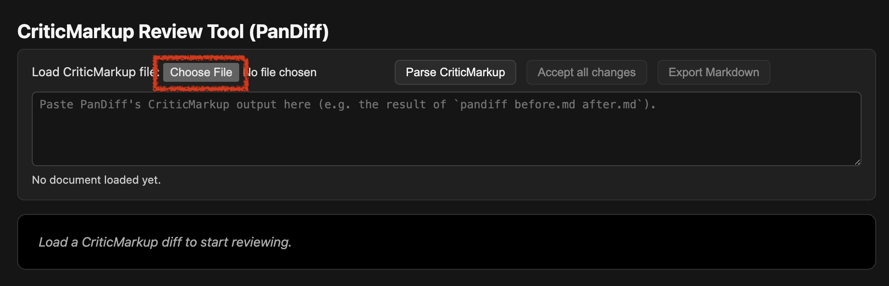
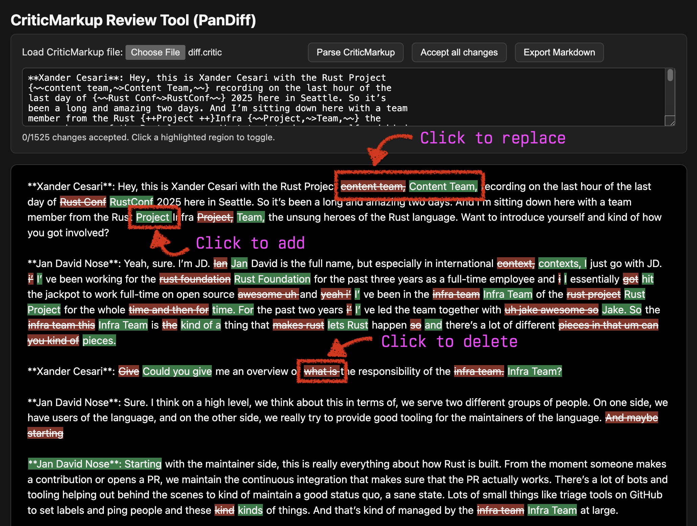
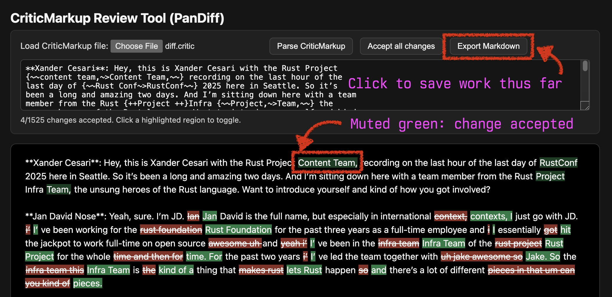

# transcript-tools

Tools to use when editing diraized transcriptions of interviews

## Assumptions

You've used [whisperX] to generate the transcript with an invocation like
the following:

```shell
uvx whisperx interview-audio.wav \
  --model large-v3-turbo \
  --diarize \
  --highlight_words True \
  --min_speakers 2 \
  --max_speakers 2 \
  --output_format json \
  --output_dir interview-transcript \
  --print_progress True \
  --compute_type float32 \
  --vad_method silero \
  --hf_token [HF_TOKEN]
```

_Note_: You must adjust `--min_speakers` and `--max_speakers` to match your interview.

## Processing pipeline

### transcript-slim

This is a one-shot script, will simply get the output.

```shell
uv run transcript-slim \
  ../interview-transcript/interview-audio.json \
  ../interview-transcript/interview-audio.slim.json \
  --speaker-map "{\"SPEAKER_01\": \"Alice Jones\", \"SPEAKER_00\": \"Bob Smith\"}"
```

### transcript-group

This is a one-shot script, will simply get the output.

```shell
uv run transcript-group \
  ../interview-transcript/interview-audio.slim.json \
  ../interview-transcript/interview-audio.group.json
```

### transcript-triage

This script is a live triage tool. Read below for more on how to use it.

```shell
uv run transcript-triage \
  ../interview-transcript/interview-audio.group.json \
  ../interview-transcript/interview-audio.triage.json
```

#### Auditing groups

```
================================================================================
Group 7 of 59

preceding group:
  speaker: 'Jan David Nose'
  segments:
    [0] I can think of a few things that have less to do, I think, with, like, the language specifically, but with some of the architecture decisions that were made .
..
    [1] Sure.
    [2] So one of the things that actually caused a lot of headache for mostly GitHub, and then when they complained to us, for us as well, is, like, for a long, lon.
..
    [3] And as Rust started to grow, the activity on the repo became so big that it actually caused, like,
    [4] some issues, I would say, friendly on the GitHub, just in terms of how much resources that single repository was consuming, which also then kind of started t.
..
    [5] And that's certainly one area where we've seen how Rust has definitely struggled a little bit with the platform, but also the platform provider struggled wit.
..
    [6] And then I think for Rust itself, especially when we look at CI, we really want to make sure that Rust works well on all of the targets and all the platforms.
..
    [7] And that means that we have an extremely wide CI pipeline where for every tier one target, we want to run all the tests, we want to build the release artifac.
..
    [8] We want to do as much as we reasonably can for tier two targets and to a lesser extent, maybe even test some stuff on tier three.
    [9] And that just increased, like, it's a gigantic, like, build pipeline.
    [10] Marco gave a talk today on, like, what we've done with CI over the last year.
    [11] And one of the numbers that came out of, like, doing the research for this talk is that we run, like, three, we accumulate, like, over three million build mi
...
    [12] And I think we're, especially when it comes to, like, open source projects, I think we're one of the, like, biggest consumers of, like, GitHub Actions in tha
...
    [13] um not the biggest in total like they're definitely like bigger commercial uh projects but that's something that i think is a unique challenge for us to kind
...
    [14] popular and like we want to target more and more platforms this is like a problem that just continues to grow like yeah we'll probably never remove a lot of 
...

active group:
  speaker: 'Xander Cesari'
  segments:
    [0] ask a cloud service provider to give you a VM running on that piece of hardware, but some of them are probably not things that you can just run in the cloud.
    [1] Is there some hill lab somewhere?

following group:
  speaker: 'Jan David Nose'
  segments:
    [0] So you're touching on a conversation that's literally happening pretty much as we speak.
    [1] So far, we essentially, as part of our target tier policy, there is a clause in there that says it needs to be able to run in CI.
    [2] And that has also meant
    [3] kind of been very selective about only promoting things to tier one that we can actually run and test.
    [4] And for all of this, we did have the, it runs on GitHub Actions essentially.
    [5] So far we've had very little, we used very little hardware that is not like natively supported or like provided by GitHub.
    [6] But, and this is exactly the point with like Rust increasing popularity, we just got like requests to support IBM platforms and RISC-V. And those are not nat.
..
    [7] And this has kicked off an internal conversation about how do we even support this?
    [8] How can we as a project essentially enable, in this case, for example, companies that can provide us hardware to test on?
    [9] But what are the implications of this?
    [10] Because on one side, there's a lot of interesting constraints that come with this, or considerations that we need to, things that we need to take into consid
...
    [11] PRs to randomly fail because someone else's hardware is not available.
    [12] We're already so resource-constrained on how many PRs we can merge each day that adding noise to that process would be a really slowdown, like the contributi
...
    [13] On the other end, there's also security implications, especially if we talk about promoting something to tier one and we want to build release artifacts on t
...
    [14] We need to make sure that those are actually secure and
    [15] no one like sneaks the back door into the rust compiler for like risk five or so yeah so there are interesting challenges for us especially like in the world
...
    [16] increasingly more I think like relevant and interesting piece to work on because so far we've gotten away with like the platforms that github supports but it
...
    [17] Some we're still trying to figure out what does this mean and what do we need to take into consideration?
    [18] What are our requirements to use external hardware essentially?

modify group segmentation? (y/n) write remaining without further changes? (w) quit? (q) y
```

We choose to modify group segmentation in this case, by entering `y`.

```
preceding group:
  speaker: 'Jan David Nose'
  segments:
    [0] I can think of a few things that have less to do, I think, with, like, the language specifically, but with some of the architecture decisions that were made .
..
    [1] Sure.
    [2] So one of the things that actually caused a lot of headache for mostly GitHub, and then when they complained to us, for us as well, is, like, for a long, lon.
..
    [3] And as Rust started to grow, the activity on the repo became so big that it actually caused, like,
    [4] some issues, I would say, friendly on the GitHub, just in terms of how much resources that single repository was consuming, which also then kind of started t.
..
    [5] And that's certainly one area where we've seen how Rust has definitely struggled a little bit with the platform, but also the platform provider struggled wit.
..
    [6] And then I think for Rust itself, especially when we look at CI, we really want to make sure that Rust works well on all of the targets and all the platforms.
..
    [7] And that means that we have an extremely wide CI pipeline where for every tier one target, we want to run all the tests, we want to build the release artifac.
..
    [8] We want to do as much as we reasonably can for tier two targets and to a lesser extent, maybe even test some stuff on tier three.
    [9] And that just increased, like, it's a gigantic, like, build pipeline.
    [10] Marco gave a talk today on, like, what we've done with CI over the last year.
    [11] And one of the numbers that came out of, like, doing the research for this talk is that we run, like, three, we accumulate, like, over three million build mi
...
    [12] And I think we're, especially when it comes to, like, open source projects, I think we're one of the, like, biggest consumers of, like, GitHub Actions in tha
...
    [13] um not the biggest in total like they're definitely like bigger commercial uh projects but that's something that i think is a unique challenge for us to kind
...
    [14] popular and like we want to target more and more platforms this is like a problem that just continues to grow like yeah we'll probably never remove a lot of 
...

active group:
  speaker: 'Xander Cesari'
  segments:
    [0] ask a cloud service provider to give you a VM running on that piece of hardware, but some of them are probably not things that you can just run in the cloud.
    [1] Is there some hill lab somewhere?

following group:
  speaker: 'Jan David Nose'
  segments:
    [0] So you're touching on a conversation that's literally happening pretty much as we speak.
    [1] So far, we essentially, as part of our target tier policy, there is a clause in there that says it needs to be able to run in CI.
    [2] And that has also meant
    [3] kind of been very selective about only promoting things to tier one that we can actually run and test.
    [4] And for all of this, we did have the, it runs on GitHub Actions essentially.
    [5] So far we've had very little, we used very little hardware that is not like natively supported or like provided by GitHub.
    [6] But, and this is exactly the point with like Rust increasing popularity, we just got like requests to support IBM platforms and RISC-V. And those are not nat
..
    [7] And this has kicked off an internal conversation about how do we even support this?
    [8] How can we as a project essentially enable, in this case, for example, companies that can provide us hardware to test on?
    [9] But what are the implications of this?
    [10] Because on one side, there's a lot of interesting constraints that come with this, or considerations that we need to, things that we need to take into consi
...
    [11] PRs to randomly fail because someone else's hardware is not available.
    [12] We're already so resource-constrained on how many PRs we can merge each day that adding noise to that process would be a really slowdown, like the contribut
...
    [13] On the other end, there's also security implications, especially if we talk about promoting something to tier one and we want to build release artifacts on 
...
    [14] We need to make sure that those are actually secure and
    [15] no one like sneaks the back door into the rust compiler for like risk five or so yeah so there are interesting challenges for us especially like in the worl
...
    [16] increasingly more I think like relevant and interesting piece to work on because so far we've gotten away with like the platforms that github supports but i
...
    [17] Some we're still trying to figure out what does this mean and what do we need to take into consideration?
    [18] What are our requirements to use external hardware essentially?

active segment:
  [0] ask a cloud service provider to give you a VM running on that piece of hardware, but some of them are probably not things that you can just run in the cloud.

preceding group (p), active group for all remaining (a), following group for all remaining (f), new group (n): p
```

The last utterance should have been grouped in the previous group, so we enter `p`.

Note how the preview now shows it under the `preceding group`:

```
preceding group:
  speaker: 'Jan David Nose'
  segments:
    [0] I can think of a few things that have less to do, I think, with, like, the language specifically, but with some of the architecture decisions that were made 
...
    [1] Sure.
    [2] So one of the things that actually caused a lot of headache for mostly GitHub, and then when they complained to us, for us as well, is, like, for a long, lon
...
    [3] And as Rust started to grow, the activity on the repo became so big that it actually caused, like,
    [4] some issues, I would say, friendly on the GitHub, just in terms of how much resources that single repository was consuming, which also then kind of started t
...
    [5] And that's certainly one area where we've seen how Rust has definitely struggled a little bit with the platform, but also the platform provider struggled wit
...
    [6] And then I think for Rust itself, especially when we look at CI, we really want to make sure that Rust works well on all of the targets and all the platforms
...
    [7] And that means that we have an extremely wide CI pipeline where for every tier one target, we want to run all the tests, we want to build the release artifac
...
    [8] We want to do as much as we reasonably can for tier two targets and to a lesser extent, maybe even test some stuff on tier three.
    [9] And that just increased, like, it's a gigantic, like, build pipeline.
    [10] Marco gave a talk today on, like, what we've done with CI over the last year.
    [11] And one of the numbers that came out of, like, doing the research for this talk is that we run, like, three, we accumulate, like, over three million build m
i...
    [12] And I think we're, especially when it comes to, like, open source projects, I think we're one of the, like, biggest consumers of, like, GitHub Actions in th
a...
    [13] um not the biggest in total like they're definitely like bigger commercial uh projects but that's something that i think is a unique challenge for us to kin
d...
    [14] popular and like we want to target more and more platforms this is like a problem that just continues to grow like yeah we'll probably never remove a lot of
 ...
    [15] ask a cloud service provider to give you a VM running on that piece of hardware, but some of them are probably not things that you can just run in the cloud
.

active group:
  speaker: 'Xander Cesari'
  segments:
    [0] Is there some hill lab somewhere?

following group:
  speaker: 'Jan David Nose'
  segments:
    [0] So you're touching on a conversation that's literally happening pretty much as we speak.
    [1] So far, we essentially, as part of our target tier policy, there is a clause in there that says it needs to be able to run in CI.
    [2] And that has also meant
    [3] kind of been very selective about only promoting things to tier one that we can actually run and test.
    [4] And for all of this, we did have the, it runs on GitHub Actions essentially.
    [5] So far we've had very little, we used very little hardware that is not like natively supported or like provided by GitHub.
    [6] But, and this is exactly the point with like Rust increasing popularity, we just got like requests to support IBM platforms and RISC-V. And those are not nat
...
    [7] And this has kicked off an internal conversation about how do we even support this?
    [8] How can we as a project essentially enable, in this case, for example, companies that can provide us hardware to test on?
    [9] But what are the implications of this?
    [10] Because on one side, there's a lot of interesting constraints that come with this, or considerations that we need to, things that we need to take into consi
d...
    [11] PRs to randomly fail because someone else's hardware is not available.
    [12] We're already so resource-constrained on how many PRs we can merge each day that adding noise to that process would be a really slowdown, like the contribut
i...
    [13] On the other end, there's also security implications, especially if we talk about promoting something to tier one and we want to build release artifacts on 
t...
    [14] We need to make sure that those are actually secure and
    [15] no one like sneaks the back door into the rust compiler for like risk five or so yeah so there are interesting challenges for us especially like in the worl
d...
    [16] increasingly more I think like relevant and interesting piece to work on because so far we've gotten away with like the platforms that github supports but i
t...
    [17] Some we're still trying to figure out what does this mean and what do we need to take into consideration?
    [18] What are our requirements to use external hardware essentially?

active segment:
  [0] Is there some hill lab somewhere?

preceding group (p), active group for all remaining (a), following group for all remaining (f), new group (n): a
```

We can now enter `a` for setting active group for all remaining:

```
================================================================================
Group 8 of 59

preceding group:
  speaker: 'Xander Cesari'
  segments:
    [0] Is there some hill lab somewhere?

active group:
  speaker: 'Jan David Nose'
  segments:
    [0] So you're touching on a conversation that's literally happening pretty much as we speak.
    [1] So far, we essentially, as part of our target tier policy, there is a clause in there that says it needs to be able to run in CI.
    [2] And that has also meant
    [3] kind of been very selective about only promoting things to tier one that we can actually run and test.
    [4] And for all of this, we did have the, it runs on GitHub Actions essentially.
    [5] So far we've had very little, we used very little hardware that is not like natively supported or like provided by GitHub.
    [6] But, and this is exactly the point with like Rust increasing popularity, we just got like requests to support IBM platforms and RISC-V. And those are not nat
...
    [7] And this has kicked off an internal conversation about how do we even support this?
    [8] How can we as a project essentially enable, in this case, for example, companies that can provide us hardware to test on?
    [9] But what are the implications of this?
    [10] Because on one side, there's a lot of interesting constraints that come with this, or considerations that we need to, things that we need to take into consi
d...
    [11] PRs to randomly fail because someone else's hardware is not available.
    [12] We're already so resource-constrained on how many PRs we can merge each day that adding noise to that process would be a really slowdown, like the contribut
i...
    [13] On the other end, there's also security implications, especially if we talk about promoting something to tier one and we want to build release artifacts on 
t...
    [14] We need to make sure that those are actually secure and
    [15] no one like sneaks the back door into the rust compiler for like risk five or so yeah so there are interesting challenges for us especially like in the worl
d...
    [16] increasingly more I think like relevant and interesting piece to work on because so far we've gotten away with like the platforms that github supports but i
t...
    [17] Some we're still trying to figure out what does this mean and what do we need to take into consideration?
    [18] What are our requirements to use external hardware essentially?

following group:
  speaker: 'Xander Cesari'
  segments:
    [0] Yeah, everyone is so excited about Rust will run everywhere, but there's a maintenance cost there that is almost exponential in scope.
```

### transcript-md

This is a one-shot script, will simply get the output.

```shell
uv run transcript-md \
  ../interview-transcript/interview-audio.triage.json \
  ../interview-transcript/interview-audio.md \
```

### diff-reviewer.html

Useful for comparing diffs between, say, the transcription as collected vs revisions made by an LLM.

#### Generating diffs

For this we use [PanDiff] with the following configuration:

```shell
pandiff \
  ../interview-transcript/interview-audio.before-revision.md \
  ../interview-transcript/interview-audio.after-revision.md \
  > ../interview-transcript/before-after.critic
```

#### Working through diffs

Double click on `diff-reviewer.html`, it'll open in a browser window.

First, load the `.critic` file by clicking on `Choose File`:



Then, work your way through the diffs clicking to accept.

Note that all of the following are supported:
- additions
- substitutions
- subtractions



Note how the change being accepted results in a muted green being used.

Finally, click `Export Markdown` to download the Markdown file.



Note that it's possible to pause mid-way through by exporting, then resume
diffing again later by loading the exported Markdown file as "before"
next time.

[whisperX]: https://github.com/m-bain/whisperX
[PanDiff]: https://github.com/davidar/pandiff
